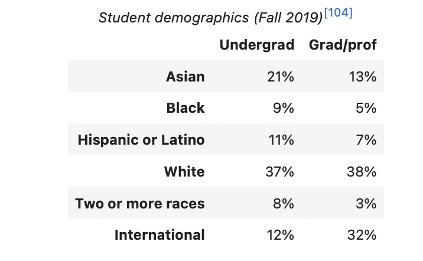
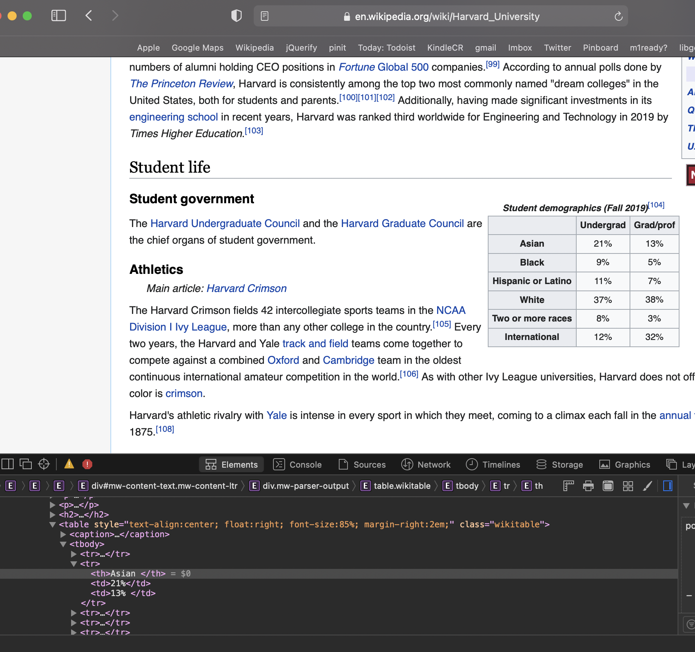
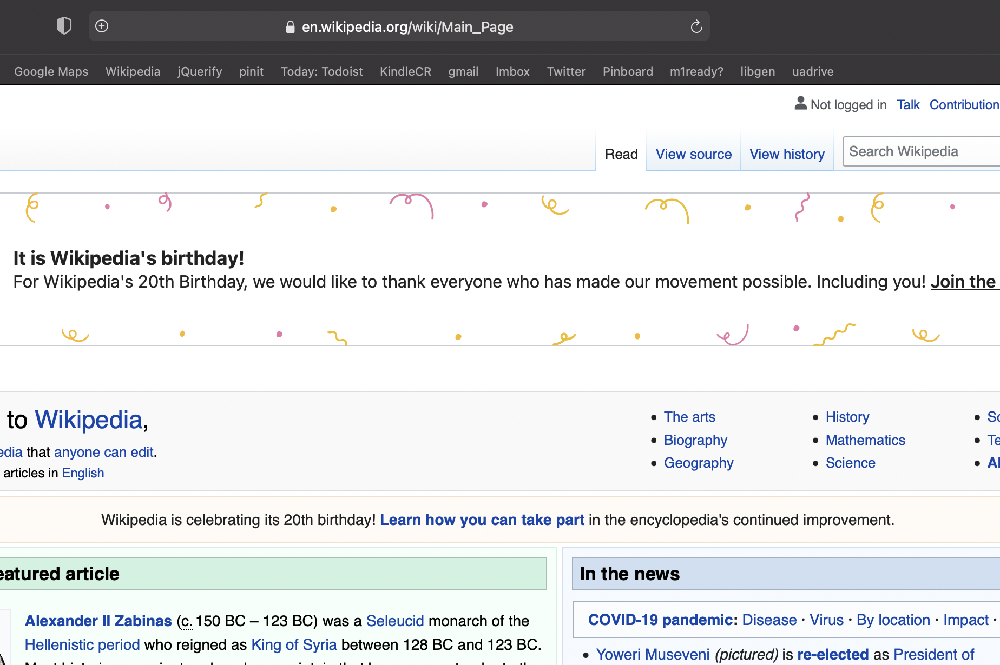
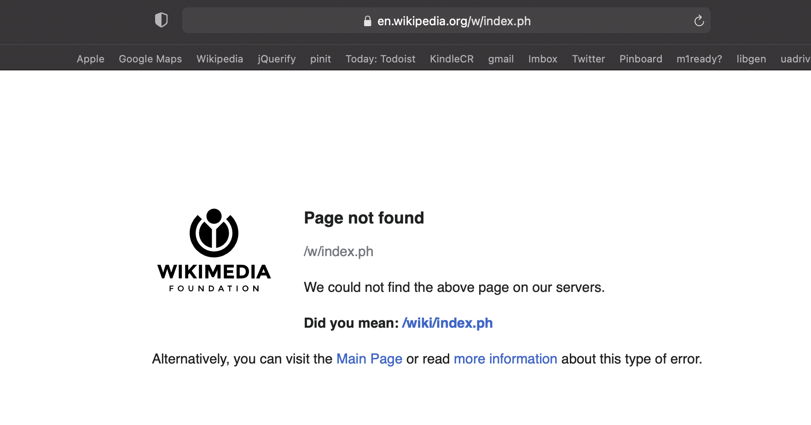
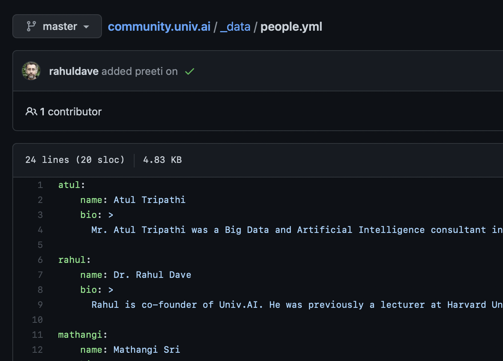
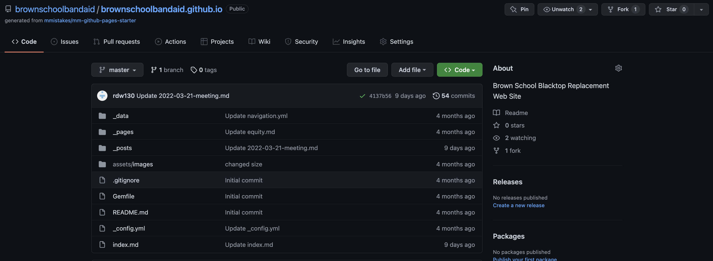

autoscale: true
footer: 
theme: UnivAI
slidenumbers: true


#[fit] A portfolio with
#[fit] Github Pages

---


# HTML

- angle brackets
- should be in pairs, eg `<p>Hello</p>`
- maybe in implicit pairs, such as `<br/>`

```html
<!DOCTYPE html>
<html>
  <head>
    <title>Title</title>
  </head>
  <body>
    <h1>Body Title</h1>
    <p>Body Content</p>
  </body>
</html>
```
---

# Developer Tools in browsers

- ctrl/cmd shift i in chrome
- cmd-option-i in safari
- look for "inspect element"
- locate details of tags

---

# Access via CSS selectors

- `.funny` means an element with class "funny": e.g. `<span class="funny">...</span>`
- `#first` means an element with id "first": e.g. <span id="first">...</span>
- you can specify the type of element. e.g. `div.funny` vs `span.funny`
- more information [here]( https://www.w3schools.com/cssref/css_selectors.asp)


---

### Demographics table we want



---

### Table with sole class `wikitable`



---

# Web Servers

- A server is a long running process (also called daemon) which listens on a pre-specified port
- and responds to a request, which is sent using a protocol called HTTP
- A browser must first we must parse the url. Everything after a # is a fragment. Until then its the DNS name or ip address, followed by the URL.

---



---

## The HTTP protocol

Our notebooks also talk to a local web server on our machines:
`http://localhost:8888/Documents/ml-1/BLA.ipynb#something`

- protocol is `http`, hostname is `localhost`, port is `8888`
- url is `/Documents/ml-1/BLA.ipynb`
- url fragment is ``#something`

Request is sent to localhost on port 8888. It says:

```
Request:
GET /Documents/ml-1/BLA.ipynb HTTP/1.0
```

---

### Example with Response: Google

```
GET / HTTP/1.0
Host: www.google.com


HTTP/1.0 200 OK
Date: Mon, 14 Nov 2016 04:49:02 GMT
Expires: -1
Cache-Control: private, max-age=0
Content-Type: text/html; charset=ISO-8859-1
P3P: CP="This is ..."
Server: gws
X-XSS-Protection: 1; mode=block
X-Frame-Options: SAMEORIGIN
Set-Cookie: NID=90=gb5q7b0...; expires=Tue, 16-May-2017 04:49:02 GMT; path=/; domain=.google.com; HttpOnly
Accept-Ranges: none
Vary: Accept-Encoding

<!doctype html><html itemscope=""
itemtype="http://schema.org/WebPage" lang="en">
<head><meta content="Search the world's information,
```

---



---

### HTTP Status Codes[^1]

[^1]: (from  http://www.garshol.priv.no/download/text/http-tut.htm)

- 200 OK:
    Means that the server did whatever the client wanted it to, and all is well.

- 201 Created:
    The request has been fulfilled and resulted in a new resource being created. The newly created resource can be referenced by the URI(s) returned in the entity of the response, with the most specific URI for the resource given by a Location header field.

- 400: Bad request
    The request sent by the client didn't have the correct syntax.

- 401: Unauthorized
    Means that the client is not allowed to access the resource. This may change if the client retries with an authorization header.

- 403: Forbidden
    The client is not allowed to access the resource and authorization will not help.

- 404: Not found
    Seen this one before? :) It means that the server has not heard of the resource and has no further clues as to what the client should do about it. In other words: dead link.

- 500: Internal server error
    Something went wrong inside the server.

- 501: Not implemented
    The request method is not supported by the server.

---

## Markdown

- simple text based format, reads like text
- easily convertible to formats such as html and latex
- used to write text cells in jupyter notebooks/colab
- used in every blogging tool/content management system out there
- a good first step to learning about more complex systems such as latex
- YOU NEED TO KNOW THIS

---

## Markdown syntax

- comes in multiple flavors
- github flavored markdown, multimarkdown, and the commonmark spec are popular ones
- we will use github flavored markdown. Its supported by jupyter/colab, great markdown editors such as typora, and most blogging tools
- it is legitimate to embed any inline html into markdown text. This can make it very useful for custom content

---

## Markdown Basics

From the [original markdown spec](https://daringfireball.net/projects/markdown/syntax):

>A paragraph is simply one or more consecutive lines of text, separated by one or more blank lines. (A blank line is any line that looks like a blank line — a line containing nothing but spaces or tabs is considered blank.) Normal paragraphs should not be indented with spaces or tabs.

I have found that having a blank line between paras works in most editors to keep the paras separate.

The following notes have been lightly edited from Typora's documentation.

---

## Headers

Headers use 1-6 hash (`#`) characters at the start of the line, corresponding to html header levels H1-H6. 

``` markdown
# This is an H1

## This is an H2

###### This is an H6
```

For example, the header of this slide is a `h2`.

---

## Basic text

[.column]

```markdown
**Bold** or __bold__
*emphasis* or _emphasis_
~~strikethrough~~
```

gets us

**Bold**, *emphasis*, and ~~strikethrough~~

`---` by itself on a line gets us a horizontal line.

[.column]

```markdown
>makes a quote
```

gives us

>makes a quote

while codish text is done thus:

```markdown
Here is some `code`.
```

Here is some `code`.

---

## Code environments

[.column]

Just indent the text in by a tab:

```markdown
    printf(5)
```

gives:

    printf(5)
    
[.column]

More specific code environments are supported in GFM via backticks and (optionally) the name of the language. So:

    ```python
    def f:
        pass
    ```

gives us:

```python
def f:
    pass
```

---

## Lists

[.column]

```markdown
- Red
- Green
- Blue
```

gives:

- Red
- Green
- Blue

[.column]

```markdown
1. Red
2. Green
3. Blue
```

gives:

1. Red
2. Green
3. Blue

---

## Links and URLs

[.column]

    This is [an example](http://example.com/ "Title") inline link.
This is [an example](http://example.com/ "Title") inline link.
    
    [This link](http://example.net/) has no title attribute.
[This link](http://example.net/) has no title attribute.

#### Literal Links (URLs) 
`<https://www.google.com>` produces <https://www.google.com>.

[.column]

#### Definition Links

    This is [an example][id] reference-style link.

Then, anywhere in the document, you define your link label on a line by itself like this: 

    [id]: http://example.com/  "Optional Title Here"

This is [an example][id] reference-style link.

[id]: http://example.com/   "Optional Title Here"

---

## Images

[.column]

The syntax for inserting an image looks like this:

``` markdown


```

[.column]

For example `` gives us 


---

## Math

We use `$` to wrap a inline TeX command. For example: `$\lim_{x \to \infty} \exp(-x) = 0$` will be rendered as LaTeX: $$\lim_{x \to \infty} \exp(-x) = 0$$ .

If you use two dollars we get block level math. So, by itself:

`$$\lim_{x \to \infty} \exp(-x) = 0$$`

gives us:

$$\lim_{x \to \infty} \exp(-x) = 0$$

---

## Tables

[.column]

In markdown source code, they look like:

``` markdown
| First Header  | Second Header |
| ------------- | ------------- |
| Content Cell  | Content Cell  |
| Content Cell  | Content Cell  |
```

You can also include inline Markdown such as links, bold, italics, or strikethrough in the table.

| First Header  | Second Header |
| ------------- | ------------- |
| Content Cell  | Content Cell  |
| Content Cell  | Content Cell  |

[.column]

Columns can also be left-aligned, right-aligned, or center-aligned:

``` markdown
| Left-Aligned  | Center Aligned  | Right Aligned |
| :------------ |:---------------:| -----:|
| col 3 is      | some wordy text | \$1600 |
| col 2 is      | centered        |   \$12 |
| zebra stripes | are neat        |    \$1 |
```

| Left-Aligned  | Center Aligned  | Right Aligned |
| :------------ |:---------------:| -----:|
| col 3 is      | some wordy text | \$1600 |
| col 2 is      | centered        |   \$12 |
| zebra stripes | are neat        |    \$1 |

---

## Conversions

There is a 1-1 correspondence between markdown syntax and html tags. And for that matter latex syntax. The software [pandoc](https://pandoc.org) will provide even further conversions, to word and other formats.

You thus do not need to know html right away, though you should get some idea of its structure by using the developer tools

---

## Content Management Systems: YAML

Yet Another Markdown Language is a simple syntax for dictionaries and lists that is used as an input to blogging and content management systems as metadata that these systems use. For example, the page for this workshop on <https://community.univ.ai> looks like this (its sandwiched between 2 sets of 3 horizontal dashes):

```yaml
---
title: "Projects and Portfolios with Github Pages"
permalink: /courses/projects-with-github-pages/
cycle: c1
kind: workshop
duration: 1.5
series: ops
difficulty_level: 'beginner'
teacher: rahul
excerpt: A workshop on using github pages to host your blog posts and project portfolios.
sequence: 8.5
header:
  overlay_image: /assets/images/visualization.jpeg
  teaser: assets/images/visualization.jpeg
runs:
  - label: "11AM EST, 9.30 PM IST, Thursday Mar 31st, 2022"
    when: 2022-03-31T21:30+05:30
    url: "https://my.univ.ai/meetups/projects-with-github-pagess-c1"
    color: primary
---
```

---

## How to render

This YAML is used as variables in templates, both site wide and document wide. The [workshop page](https://community.univ.ai/courses/projects-with-github-pages/) is rendered using this template:

[.column]

```jinja
## What?

{{ page.excerpt }}

## When and Where?


<span class="notice--{{ item.color}}">
{{ item.label }}&nbsp;&nbsp;</span>
[Register]({{ item.url}})
{: .btn .btn--large .btn--{{ item.color}}}



...

## Who?

**{{ site.data.people[page.teacher].name }}**

{{ site.data.people[page.teacher].bio }}
```

[.column]

The site part comes from another file:



---

## The structure of Jekyll



---

## Your first site

Go to <https://github.com/rahuldave/gpages> and follow the instructions there.

You will be here creating a very basic site. This site is NOT adequate for a personal portfolio but gets you started.

And it gets you going with my second silent aim in this workshop: it gets you hacking

---

## Why you should blog?

See <https://medium.com/@racheltho/why-you-yes-you-should-blog-7d2544ac1045>.

- RECALL: Writing what you learned imprints it into the brain
- TEACH: Others will learn from it. You are best positioned to help people just behind you.
- SOCIAL: you will create a network which will help you with job offers and gigs

Dont be a perfectionist!

---

## Blog Ideas

- links to other amazing blog posts. Especially if you put these in acontext of a review on a particular subject.
- Summarize a class or track at a conference, or a book.
- If you've answered or asked a question more than once, chances are many others had the same doubt! Write it up!

---

## From blog to portfolio

This now is your homework.

Create a repo: username.github.io . Github will make this into a personal site. See <https://pages.github.com/>.

Use the Minimal Mistakes Theme: <https://mmistakes.github.io/minimal-mistakes/docs/quick-start-guide/>. I found it useful to use their template at <https://github.com/mmistakes/mm-github-pages-starter/generate> which generates your repo for you.

Now make sure you have a blog section and an about page where you put your CV/linked-in, etc up. You can also create one-off pages for more permanent things like apps. Use categories and tags to highlight projects, or writings, etc

